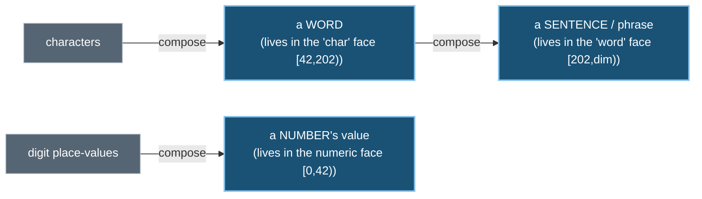
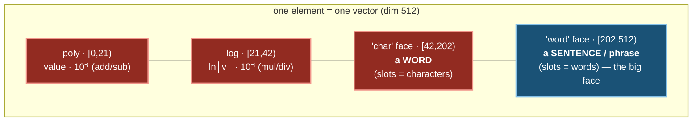
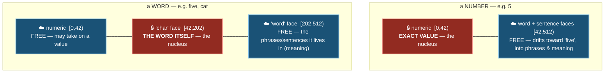
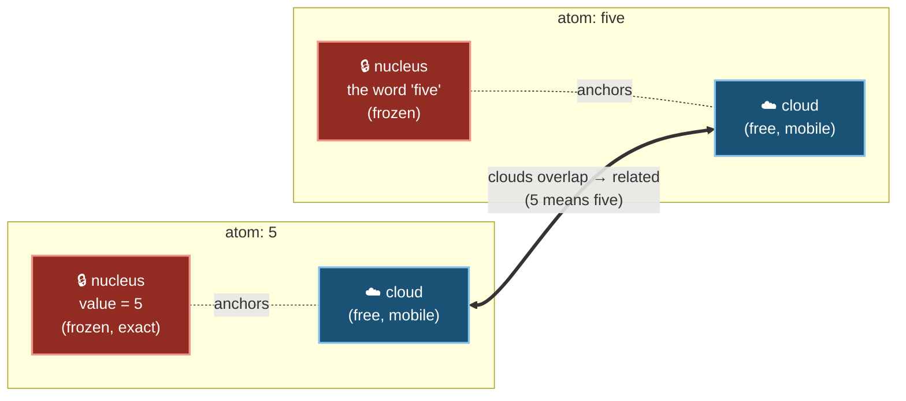

# The Nucleus & the Cloud — how an element stores data across its dimensions

> Every element is a single vector, but its dimensions are not equal. Some are a **frozen nucleus** — the element's
> exact, immutable *identity*. The rest are a **free electron cloud** — where *meaning* lives and moves. The nucleus
> is the fixed structure everything else pivots off of: an element can drift, cluster, and relate in the free
> dimensions all it likes, and its identity never moves — in the current substrate it is re-derived from the symbol
> rather than stored, so it cannot drift (the legacy fallback restored the frozen dimensions after every step).
>
> This is the genesis dual-face (`research/03-SYMMETRY-BRIDGE` Corr. 7): the **arithmetic face is *like* the
> proton/nucleus** (crisp, conserved, exact), the **semantic face is *like* the electron orbital** (distributed,
> probabilistic, mobile).
> Companions: `PLATONIC_THEORY.md` (the formal model), `PLATONIC_CONSCIOUSNESS.md`, `PLATONIC_RECKONING.md`.

> **On the physics language (read this first).** "Nucleus", "orbital", "proton/electron", "conservation" are an
> **inspiration — a generative metaphor**, not a claim that the system models physics. A platonic space is a space
> of *ideas*; we are free to choose its rules as long as they satisfy the axioms (G1–G6, `PLATONIC_THEORY.md`). The
> literal content is mundane and checkable: some vector dimensions are an exact, never-mutated *identity* region;
> the rest are a learnable *meaning* region. Read the physics words as a vivid name for that split, nothing more.

---

## ⚠️ A note on the names: each face is named for its SLOTS, but holds the COMPOSITE one level up

The face names describe what each **slot holds** (the components), not what the face **represents**. Read them one
level up:

| face (named for slots) | slots hold… | …so the face actually represents | composition |
|---|---|---|---|
| numeric (poly/log) | digit place-values | a **NUMBER** (its value) | digits → number |
| **"char"** `[42,202)` | characters | a **WORD** (its identity) | chars → **word** |
| **"word"** `[202,dim)` | words | a **SENTENCE / phrase** | words → **sentence** |

So: the char face stores a **word**, and the word face stores a **sentence** (a whole phrase of words). The names
are off by one level — each is named for its atoms, but holds the thing those atoms compose.



---

## 1. One vector, two kinds of dimension

A concept is a vector of width `dim` (production 512). Reading left→right is reading from the crisp **nucleus** to
the diffuse **cloud**:



- **Low end — small, crisp, structured.** 42 dims of pure algebra: a number's value, encoded so that
  `embed(a)+embed(b) = embed(a+b)`. Exact, generalizes to unseen operands, zero stored facts.
- **Middle — a word's identity.** The "char" face holds a word (composed from its characters): its fixed lexical
  fingerprint.
- **High end — large, diffuse, relational.** 310 dims (≈60% of the vector) — the "word" face holds a **sentence /
  phrase of words**, and this is where a concept's meaning lives as a *cloud*: a superposition of the words and
  phrases it appears with. Ambiguity lives here — a two-sense word is near *both* senses at once.

---

## 2. What is frozen depends on what the element *is*

The frozen (identity) region differs by element kind. A number's identity is its *value*; a word's identity is the
*word itself* (its char-composed form).

> **How the current substrate realizes this (`Cognition/Platonic/*`, default `UseDialecticalCore=true`).** Identity
> is not snapped-back after edits — it is **never stored at all**. An element keeps only its learnable orbital (the
> word face `[202,dim)`) plus its structural part-of edges; the whole identity nucleus (arithmetic + char faces) is
> **recomputed from the symbol via the codec on demand** (`FaceCodec.AssemblePositiveFace`,
> `Element.cs:25–29`), so it *cannot* drift. The single mutable region is the word face `[202,dim)`
> (`FaceCodec.SemanticStart = FaceLayout.WordFaceStart`, `FaceCodec.cs:18–19`) — for **both** numbers and words. So
> below, treat the char face `[42,202)` and the numeric face `[0,42)` as part of the *codec-derived identity*; only
> the word/sentence face `[202,dim)` actually moves. (The diagrams keep the original per-kind split for intuition;
> the legacy `PlatonicSpaceMemory` fallback did snap identity back after each step via `RestoreFrozenIdentity` —
> the current default avoids drift by never storing identity.)



| element | frozen nucleus (identity) | free cloud (meaning) |
|---|---|---|
| number `5` | numeric `[0,42)` — the exact value | the word/sentence faces — settles near `five`, gains meaning |
| word `five` / `cat` | the "char" face `[42,202)` — **the word itself** | numeric + the "word"/sentence face — value + the phrases it appears in |
| sentence / phrase | composed from its word-slots in the "word" face `[202,dim)` | (its meaning cloud) |

---

## 3. The nucleus is the pivot: identity holds still while meaning moves

This is the whole point. Two elements can have **completely different nuclei** yet let their **clouds overlap** —
that overlap *is* "they're related / they mean the same." The fixed nuclei are the reference frame the relational
geometry pivots off of; the clouds (the sentence-level "word" face) are where all the moving happens.



`5` and `five` will never be confused — their nuclei (exact value vs the exact word) are fixed and distinct forever.
But their *meaning clouds* drift together until they overlap, so retrieval treats them as the same thing. Identity
and meaning are stored in **different dimensions**, so you get both: permanent identity *and* fluid, shared,
ambiguous meaning.

### Why the cloud can move without ever corrupting identity

Every relational update touches only the free (word-face) dimensions; the nucleus never moves, and the complement
(`¬e = −e`, G4) is re-enforced. In the current default substrate the nucleus is never *stored*, so it cannot drift
(it is re-derived from the symbol via the codec); the legacy fallback snapped it back exact after each step
(`RestoreFrozenIdentity`). Either way, learning is *all* in the cloud:

```mermaid
sequenceDiagram
  participant E as element
  participant Obs as observe(a, b, κ)
  Obs->>E: move the FREE word-face orbital toward (agree) / away (contradict) the neighbour
  Obs->>E: identity stays exact (codec-derived — never stored; legacy fallback snapped it back)
  Obs->>E: enforce ¬e = −e (G4 conservation)
  Note over E: only meaning moved — value & the word itself are untouched
```

---

## 4. Why this structure is the right way to store data

- **Identity is permanent and free of charge.** Because identity lives in frozen dims, an element can be pushed
  anywhere in the cloud and still decode to exactly itself — its value, or the word it is. No amount of relational
  learning can corrupt what a thing *is*. (Current default: identity is codec-derived and never stored, so it
  can't drift; the legacy fallback restored it after every move via `RestoreFrozenIdentity`.)
- **The nucleus is a fixed coordinate frame.** Relations don't float in a vacuum — they pivot off the stable
  nuclei. You always know *what* two elements are; learning only settles *how they relate*.
- **Exact computation rides the frozen nucleus.** Arithmetic is read straight off the numeric nucleus
  (`embed(a)+embed(b)=embed(a+b)`), exact and generalizing, regardless of whatever the cloud is doing.
- **Meaning is large, distributed, and ambiguous — on purpose.** The big "word" face holds meaning as a
  *superposition of the phrases a concept appears in* (a sentence is literally a phrase of words), so related
  concepts cluster, unrelated ones go orthogonal, and a word with two senses sits near both at once. A single point
  couldn't do that; a cloud can.
- **The whole thing is a composition ladder.** digits → number, characters → word, words → sentence — each face
  holds the composite of the level below, and growth is *reuse* of the shared parts beneath it.
- **The two ends mirror each other.** Crisp quantity at the low end (the metaphorical "proton"), diffuse meaning at
  the high end (the metaphorical "orbital"), bound by the G4 conservation rule. Quantity is exact and singular;
  meaning is rich and plural. The layout puts each where it belongs.
