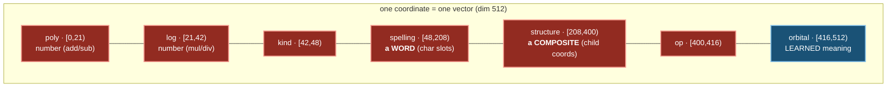
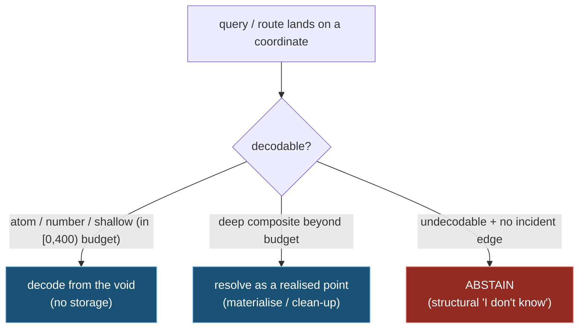

# The Address Space: every coordinate is an element, realised or latent

> The platonic space is not a container you fill with elements. It is a **deterministic address space** in which
> **every coordinate already *is* a specific, fully-defined element** — whether or not anything has been instantiated
> there. The frozen faces of a vector are an **invertible codec**: given a coordinate you can *decode* which element
> it is; given an element you can *compute* its coordinate. So the "empty void" between the points we have placed is
> not absence — it is **structure not yet realised**, latent forms with addresses we can compute but have not visited.
>
> This is the generalisation of the one fragment that already works. `84 + 57` routes to coordinate `141` — which was
> **never stored**, decodes deterministically (`poly[0]×10`), and is a perfectly real element the instant you look.
> Arithmetic is *zero stored facts* because the answer lives in the void and the homomorphism is the route into it.
> Everything below extends that single behaviour — make the char, structure, and op faces decode like the number face
> already does — to the whole space.
>
> The consequence is the architecture: **a realised element only ever needs to route to (a) another realised element,
> or (b) a blank coordinate the codec will decode when touched.** You never store a point merely to *name* it or to be
> a routing *target*. You store a point only when it carries something **non-derivable** — learned meaning, or an
> observed edge. The store collapses to *realised meaning + edges*; identity and addressing are free.
>
> Companions: `PLATONIC_THEORY.md` (the formal model — this realises §4 Composition and §9.3 layout),
> `PLATONIC_CONSCIOUSNESS.md`.

> **On the physics / "nucleus / orbital" language (read this first).** A platonic space is a space of *ideas*; its
> rules are ours to choose so long as they stay sound under the axioms (G1-G6, `PLATONIC_THEORY.md`). The literal,
> checkable content is mundane: most of a vector's dimensions are a **frozen, invertible address** (an exact identity
> you can decode); a small tail is a **learnable meaning** region that only *realised* elements populate. "Nucleus",
> "orbital", "void", "potentiality" are vivid names for that split, nothing more.

---

## ⚠️ A note on the names: each face is named for its SLOTS, but holds the COMPOSITE one level up

The face names describe what each **slot holds** (the components), not what the face **represents**. Read them one
level up:

| face (named for slots) | slots hold… | …so the face actually represents | composition |
|---|---|---|---|
| numeric (poly/log) | digit place-values | a **NUMBER** (its value) | digits → number |
| **spelling** | characters | a **WORD** (its identity) | chars → **word** |
| **structure** | element coordinates | a **RELATION / FACT / PHRASE** | elements → **composite** |

Each is named for its atoms but holds the thing those atoms compose — and in every case the composition is a
**reversible** encode: you can read the slots back out and recover what was composed.

---

## 1. One vector = one address; the bands decode to the element

A coordinate is a vector of width `dim` (proposed 512). Reading left→right is reading from the crisp, low-entropy
**identity nucleus** to the diffuse **meaning tail**. The frozen bands `[0, OrbitalStart)` are a pure function of the
*symbol* and are **identical for a blank coordinate and a realised one** — that is what makes them an address. Only
the orbital tail differs between "latent" and "realised".

| band | dims | encodes | which kinds | frozen? |
|---|---|---|---|---|
| **poly** | `[0,21)` | number value, `e[i]=v·10^-(i+1)` | numeric atom | ✅ |
| **log** | `[21,42)` | number value, `e[i]=ln\|v\|·10^-(i+1)` | numeric atom | ✅ |
| **kind** | `[42,48)` | deterministic code per kind | all non-numeric (numbers are read off poly/log) | ✅ |
| **spelling** | `[48,208)` *(tunable: 16 char-slots × 10)* | the literal token, slot *i* = atom of `s[i]` | char atom, word | ✅ |
| **structure** | `[208,400)` *(tunable: 6 child-slots × 32 = digest 24 + role 8)* | ordered child coordinates + label | composition, relation, fact | ✅ |
| **op** | `[400,416)` | which operation (a route over the address space) | function | ✅ |
| **orbital** | `[416,512)` | **learned meaning** (the distributional cloud) | **materialised elements only** | ❌ |

The whole region `[0, 416)` is **frozen, codec-derived, invertible address**; only `[416, dim)` is the mobile,
learned tail. The number bands `[0,42)` stay **byte-identical** to today's `FaceLayout` — the homomorphism is sacred,
and it is the existence proof that the rest of this layout is buildable.

---

## 2. The codec is invertible: encode/decode per kind

Every frozen band has an exact (or near-exact, small-vocabulary) inverse. This is what lets a coordinate *be* an
element with no stored node.

- **Number** → poly/log only; rest zero. **Decode:** `v = poly[0]×10` (or `v = exp(log[0]×10)` on the mul/div face).
  Exact, for any number whether stored or not. *Realised today:* `GetFreshNumericEmbedding` ↔
  `DecodeNumericFromPrediction` (the exact inverse).
- **Char atom** → `kind` + one spelling slot. **Decode:** nearest char-atom in the ~95-char vocab → the char.
  Deterministic.
- **Word** → `kind` + spelling slots = its letters. **Decode:** read each slot back to a char → the string. **No more
  random word-identity hash** — spelling *is* the identity, and it is invertible. *Build target:* `CharSlotDecode`,
  the inverse of `GetCharComposedEmbedding` (we already ship the numeric and word-slot inverses; the char inverse is
  the missing one).
- **Function / op** → `kind` + op-code. **Decode:** nearest op-code → which operation. The op is then a *route*
  (coordinate → coordinate), exactly like `+`: a function **encodes information** by mapping addresses, not by storing
  outputs.
- **Composition / Relation / Fact** → `structure` band holds the ordered child *coordinates* + a label. **Decode:**
  recurse into each child coordinate (bottoming out at atoms, which decode exactly) + read the label. A fact between
  two short atoms decodes from the void with no storage.

---

## 3. Materialised vs latent — and why kNN comes back

A coordinate is **latent** until something non-derivable is written there. The distinction is sharp:

| | frozen bands `[0,416)` | orbital tail `[416,dim)` |
|---|---|---|
| **latent (blank) coordinate** | computed from the codec (the address) | **zero** |
| **realised element** | identical codec address | learned meaning cloud |

So the store holds **only realised points** (those with a learned orbital or an incident edge), and an edge may point
at a *latent* coordinate that the codec will decode on demand. The vocabulary no longer bloats the store — only
*knowledge* does (the learned tails + the edges).

This is what brings back **kNN at scale**, which hub-dilution had killed:

- **Identity / addressing kNN** runs over the frozen bands. They are deterministic and drift-free, so neighbours are
  exact and stable — and **latent coordinates are first-class neighbours** (their address is computable without being
  stored). "Nearest decodable point" is just what addressing should be.
- **Semantic kNN** runs over the orbital tail — and **only materialised elements have a non-zero tail.** The drift and
  hub-dilution that blurred everything are now quarantined to a small region that only meaning-bearing points populate;
  it can no longer pollute addressing.

> The thing that killed kNN was *every* element carrying a learned, drifting cloud across the whole high face. Now the
> wiggle is a 96-dim tail on realised points only; the rest is frozen coordinate. Only the materialised elements have
> the unused faces left free to move.

---

## 4. The void is dense for atoms, budget-bounded for composites

Potentiality is **total** in `[0,208)` (numbers, chars, words): every coordinate there decodes exactly, so you can
route freely into the blank and the codec always answers. It is **budget-bounded** in the `structure` band `[208,400)`.

A child-slot digest (24 dims) decodes a **numeric child exactly** (a 3-dim poly/log digest recovers the value) and a
**short atom child** (a few char-slots), but it cannot hold a long word inline. Therefore:

- Shallow composites of atom children → **fully latent**: decode from the void, never stored (an arithmetic result; a
  fact between short tokens).
- Composites whose children exceed the digest → the structure band addresses the child as a **realised point** (clean
  up against its full spelling band). I.e. deep/rich composites **materialise**; the void stays dense exactly where it
  is cheap.

This is the one honest boundary: the address space is infinite and free for leaves and shallow structure, and you pay
storage only for depth. The `structure` arity and the `spelling` width are the two dimension knobs that set how deep
"free" reaches before a composite must materialise.

Abstention falls out for free: "I don't know" is **the route landed in undecodable void with no supporting edge** — a
structural criterion, not a tuned confidence threshold.

---

## 5. Why this is the right way to store data

- **Identity is permanent, free, and never needs a node.** Every coordinate decodes to exactly one element; no amount
  of relational learning can corrupt what a thing *is*, because identity is *computed*, not stored.
- **The store shrinks to its irreducible floor.** You stop paying for vocabulary. Only realised meaning (orbital tails)
  and observed edges persist; the millions of merely-named or merely-targeted points stay latent.
- **Exact computation rides the frozen address.** Arithmetic reads straight off the numeric bands
  (`embed(a)+embed(b)=embed(a+b)`); a function is a *route* over addresses, so it generalises to unseen inputs with no
  stored table.
- **Meaning stays large, distributed, ambiguous — but contained.** The orbital tail still holds meaning as a
  superposition of contexts (related cluster, a two-sense word sits near both), but it is a *tail on realised points*,
  not a property of every coordinate. Ambiguity lives there; identity never does.
- **kNN is exact again.** Addressing runs over frozen, drift-free bands; semantic similarity over a small materialised
  tail. The two never contaminate each other.
- **It is one composition ladder, reversible at every rung.** digits → number, chars → word, elements → composite —
  each band holds the composite of the level below *and can be read back into its parts*. Growth is reuse; recall is
  decode.

---

## Status: realised vs build target

- **Realised today (the existence proof):** the number bands `[0,42)` and their exact inverse
  (`PlatonicFaceComposer.GetFreshNumericEmbedding` ↔ `PlatonicFaceDecoder.DecodeNumericFromPrediction`). A latent
  number coordinate already decodes with zero storage.
- **Build target (this document is the spec):**
  1. `FaceLayout` reallocation to the bands in §1 (shrink the learned region to the `[416,dim)` tail; reclaim the high
     dims as frozen `kind` / `spelling` / `structure` / `op` address).
  2. `CharSlotDecode` — the missing inverse of the spelling band (§2), so words decode from the void like numbers do.
  3. The `structure` band as recursive child-coordinate encoding (§4), with the arity/width budget that bounds how
     deep the void stays free.
  4. Routing + retrieval read the frozen address bands for identity (latent coordinates are valid targets) and the
     orbital tail only for learned similarity; abstain on undecodable-void-with-no-edge.

The number fragment proves the pattern; the work is to make the other frozen bands decode the same way, so the whole
space becomes the deterministic field of potentiality this document describes.
